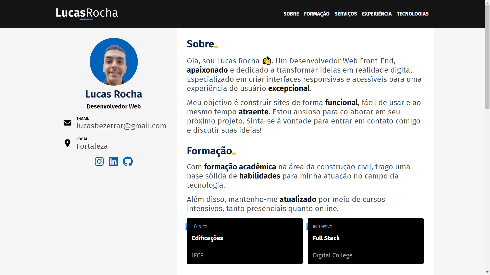

# Portfólio - v1.0 

  

 

## Resumo

Portfólio pessoal que apresenta alguns dos meus projetos no GitHub, bem como meu currículo e habilidades técnicas. 
<a href="https://lucasrochabz.github.io/portfolio/" target="_blank">Clique e confira.</a>

Tecnologias utilizadas:

- HTML5
- CSS3
- JavaScript

## Recursos

**📷 Lightbox**

**📜 Smooth Scroll**

**📱 Totalmente responsivo**
