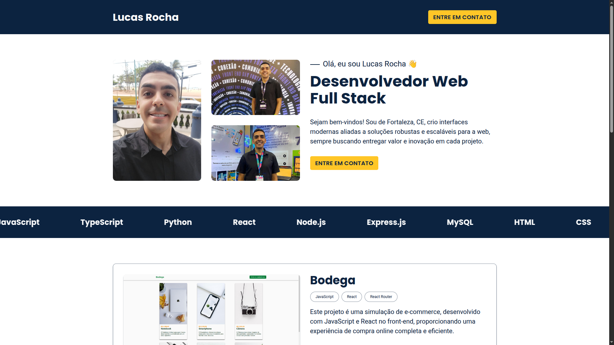

# Portfolio



Este projeto é meu portfólio como desenvolvedor, onde apresento minha trajetória, habilidades e alguns dos projetos que fazem parte da minha evolução profissional.

**Acesse**: https://lucasrochabz.vercel.app/

## Tecnologias

| Tecnologia   | Descrição                |
| ------------ | ------------------------ |
| JavaScript   | Linguagem de programação |
| React        | Biblioteca de UI         |
| React Router | Rotas na aplicação       |
| Vite         | Build tool               |
| HTML         | Estrutura de páginas     |
| CSS Modules  | Estilos modulares        |

## Requisitos

- Node na versão 22.12 ou superior
- NPM na versão 10.9 ou superior.

## Como executar

1. Faça o clone do projeto.
2. Abra o terminal e navegue até a pasta do projeto.
3. Instale as dependências usando o comando:
   ```bash
   npm install
   ```
4. Inicie o servidor localmente com o comando:
   ```bash
   npm run dev
   ```

## Estrutura do projeto

```bash
portfolio/
├── public/
│   ├── favicon.svg
│   ├── icon-192.png
│   ├── icon-512.png
│   └── manifest.json
│
├── src/
│   ├── assets/
│   │   ├── illustrations/
│   │   ├── images/
│   │   └── projects/
│   │
│   ├── components/
│   │   ├── Header/
│   │   │   ├── Header.jsx
│   │   │   ├── Header.module.css
│   │   │   └── index.js
│   │   └── ...
│   │
│   ├── constants/
│   │   ├── navigation.js
│   │   └── paths.js
│   │
│   ├── data/
│   │   ├── changelog.js
│   │   ├── contact.js
│   │   ├── courses.js
│   │   ├── experiences.js
│   │   ├── profile.js
│   │   └── projects.js
│   │
│   ├── layouts/
│   ├── pages/
│   │   ├── AboutPage/
│   │   │   ├── AboutPage.jsx
│   │   │   ├── AboutPage.module.css
│   │   │   └── index.js
│   │   └── ...
│   │
│   ├── routes/
│   │   └── app.routes.jsx
│   │
│   ├── styles/
│   │   ├── base/
│   │   ├── tokens/
│   │   ├── utilities/
│   │   └── index.css
│   │
│   ├── utils/
│   │   └── getImage.js
│   │
│   ├── App.jsx
│   └── main.jsx
│
├── .eslintrc
├── .gitignore
├── index.html
├── jsconfig.json
├── package.json
├── package-lock.json
├── README.md
├── vercel.json
└── vite.config.js
```

## Encontrou algum problema?

Abra uma [issue](https://github.com/lucasrochabz/portifolio/issues) com sua sugestão ou crítica.
