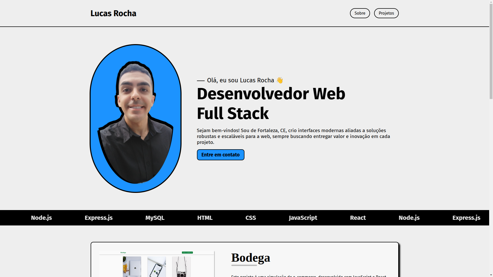

## Portfolio v2.0.0



### Sobre

Este projeto é meu portfólio como desenvolvedor, onde apresento um pouco sobre minha trajetória, minhas habilidades e alguns dos projetos que desenvolvi. A ideia é reunir em um só lugar tudo o que representa minha evolução como profissional e minhas principais criações no mundo da programação.

### Tecnologias

- **JavaScript**: Linguagem de programação utilizada no projeto.
- **React**: Biblioteca JavaScript para criação de interfaces de usuário.
- **React Router**: Gerenciamento de rotas na aplicação.
- **HTML**: Linguagem de marcação utilizada para estruturar as páginas do projeto.
- **CSS**: Linguagem de estilos utilizada para a estilização da interface.

### Requisitos

- Node na versão versão 22.12 ou superior
- NPM na versão 10.9 ou superior.

### Como instalar?

1. Faça o clone do projeto.
2. Abra o terminal e navegue até a pasta do projeto.
3. Faça uma cópia do arquivo **.env.example**:
   ```bash
   cp .env.example .env
   ```
4. Edite o arquivo **.env** com os valores apropriados para o seu ambiente.
5. Instale as dependências usando o comando:
   ```bash
   npm install
   ```
6. Inicie o servidor localmente com o comando:
   ```bash
   npm run dev
   ```

### Estrutura do projeto

```bash
portfolio/
├── public/
│   └── lucas01.png
│
├── src/
│   ├── assets/
│   │   └── images/
│   │
│   ├── components/
│   ├── App.css
│   ├── App.jsx
│   └── main.jsx
│
├── .eslintrc
├── .gitignore
├── index.html
├── package-lock.json
├── package.json
├── README.md
└── vite.config.js
```

### Encontrou algum problema?

Abra uma [issue](https://github.com/lucasrochabz/portifolio/issues) com sua sugestão ou crítica.
